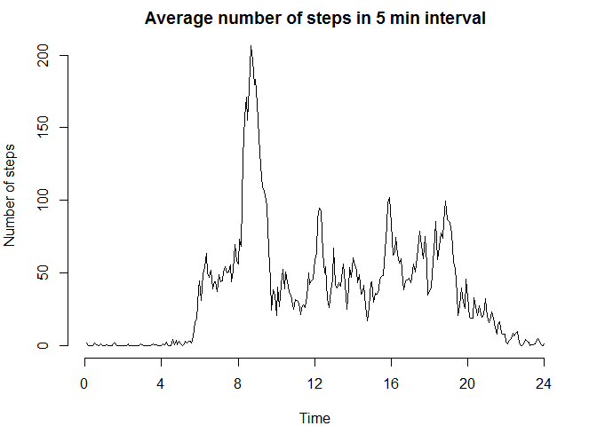

# Reproducible Research: Peer Assessment 1


*******************


## Loading and preprocessing the data

Reading the data from the file 'activity.csv' that containing 3 columns:

+ Steps: Number of steps taking in a 5-minute interval

+ Date: The date on which the measurement was taken

+ Interval: Identifier for the 5-minute interval in which measurement was taken


```r
activity <- read.csv("activity.csv")
```

*******************

## What is mean total number of steps taken per day?
Analysing the steps taken each day, omitting missing values.
The values are summarized in a histogram. 
Then the mean and median steps taken per day are calculated

```r
tab1 <- na.omit(as.data.frame(tapply(activity$steps,as.factor(activity$date), sum)))

par(mar=c(4,4,2,2), cex=1)

hist(tab1[,1], xlab="Number of steps per day", 
     main="Distribution of the number of steps per day")
```

 

```r
summary = summary(tab1)
c(summary[4],summary[3])
```

```
## [1] "Mean   :10766  " "Median :10765  "
```

*******************

## What is the average daily activity pattern?
Analysing a daily activity pattern: the average number of steps per 5-minutes intervals, averaged over all days, is calulated, again omitting missing data. 

```r
activityVals <- subset(activity,!is.na(activity$steps))
tab2 <- tapply(activityVals$steps,as.factor(activityVals$interval), mean)

par(mar=c(4,4,2,2), cex=1)

plot(tab2, xlab="Time", axes=FALSE, ylab="Number of steps", 
     main="Average number of steps /5 min interval", 
     type="l")
axis(2)
axis(1, at=c(0,48,96,144,192,240,288), labels=c("0","4","8","12","16","20","24")) 
```

 

The 5-minute interval with the highest number of average steps is calulated:


```r
rownames(tab2)[match(max(tab2),tab2)]
```

```
## [1] "835"
```

*******************

## Imputing missing values
+ Calculating the number of missing values:

```r
sum(is.na(activity$steps))
```

```
## [1] 2304
```
+ Then the missing values are filled in by taking the average number of steps of the corresponding 5 minute interval (rounded to integer values) calculated in part 2.

```r
library(stringr)

fill <- function(row) {
  
  if(is.na(row[1]))
    row[1] <- round(tab2[as.character(as.integer(row[3]))])
  
  return(row)
}
activityFilled <- as.data.frame(aperm(apply(activity,1,fill),perm=c(2,1)))
```
+ Analysing the steps taken each day and summarize the values in a histogram (same as for the original dataset)
Then the mean and median steps taken per day are calculated

```r
tab3 <- tapply(as.integer(as.character(activityFilled$steps)),
               as.factor(activityFilled$date), sum)

hist(tab3, xlab="Number of steps per day", 
     main="Distribution of the number of steps per day")
```

 

```r
summary = summary(tab3)
c(summary[4],summary[3])
```

```
##   Mean Median 
##  10770  10760
```
By filling in days without data with the mean of steps over all days, obviously, the mean and median of steps only changes a little, in particular the median should get closer to the mean.
However, the number of days has increased, with the additional days all having very close to the mean of steps and therefore being added to the middle bin. 


*******************

## Are there differences in activity patterns between weekdays and weekends?
Comparing weekend and workday activity.
Here is a new factor added - wether a date is a weekday or workday. 
To make sure we use the same day names were ever the code is run, the locale is set explicitly. 

```r
Sys.setlocale("LC_TIME", "English")
```

```
## [1] "English_United States.1252"
```

```r
activityFilled$wDay <- 
  as.factor(ifelse((weekdays(as.Date(activityFilled[[2]])) == "Sunday" | 
                    weekdays(as.Date(activityFilled[[2]])) == "Saturday"), 
                   "weekend", "workday"))

activityWE <- subset(activityFilled,(activityFilled$wDay=="weekend"))
activityWD <- subset(activityFilled,(activityFilled$wDay=="workday"))
```
Now we calculate the 5 minute intervals averaged over workdays and weekends separately and plot it:

```r
tabWD <- data.frame(matrix(NA, nrow = 288, ncol = 0))
tabWD$interval <- as.integer(rownames(tab2))
tabWD$steps <- tapply(as.integer(as.character(activityWD$steps)),
                as.factor(activityWD$interval), mean)
tabWD$day <- as.factor(rep("Workday", 288))

tabWE <- data.frame(matrix(NA, nrow = 288, ncol = 0))
tabWE$interval <- as.integer(rownames(tab2))
tabWE$steps <- tapply(as.integer(as.character(activityWE$steps)),
                as.factor(activityWE$interval), mean)
tabWE$day <- as.factor(rep("Weekday", 288))

tab4 = rbind(tabWE, tabWD)

library(lattice)
xyplot(steps~interval|day, data = tab4, type="l",
   main="Average number of steps per 5 minute interval",
   xlab="Interval",
   ylab="Number of steps",
   layout=c(1,2))
```

 


*******************
